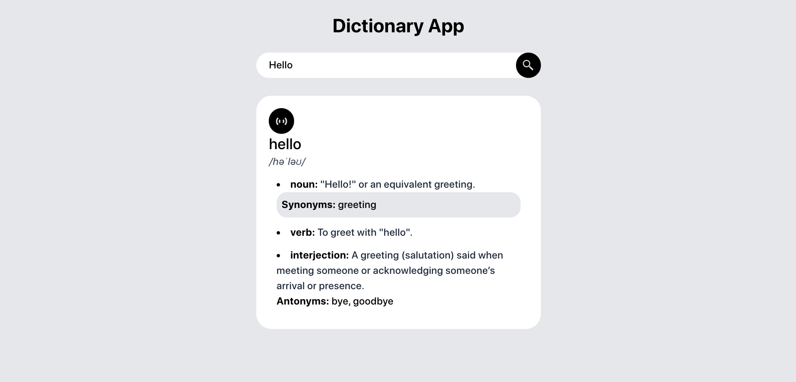

# Dictionary App

## Overview

The **Dictionary App** is a web-based application that allows users to search for word definitions, synonyms, antonyms, and pronunciations. The app provides a clean and user-friendly interface for an efficient lookup experience.

## Features

- **Word Search**: Users can search for any word to get its meaning, pronunciation, synonyms, and antonyms.
- **Phonetics**: Displays the correct pronunciation of the searched word.
- **Synonyms & Antonyms**: Provides alternative words and opposites for better vocabulary building.
- **Responsive UI**: A sleek and modern interface that adapts to different screen sizes.

## Tech Stack

- **Frontend**: React.js
- **Backend**: Node.js (if applicable) or directly fetches data from an external dictionary API
- **API**: Dictionary API for word definitions and related data
- **Styling**: CSS/Tailwind for a clean and modern look

## Installation

### Steps to Run the Project

1. **Clone the repository**

   ```sh
   git clone https://github.com/Anujkulal/Dictionary-app.git
   cd Dictionary-app
   ```

2. **Install dependencies**

   ```sh
   npm i
   ```

3. **Start the application**

   ```sh
   npm run dev
   ```


## Screenshots



## Contact

For any queries, contact: 

[](mailto\:anujkulal333@gmail.com)

